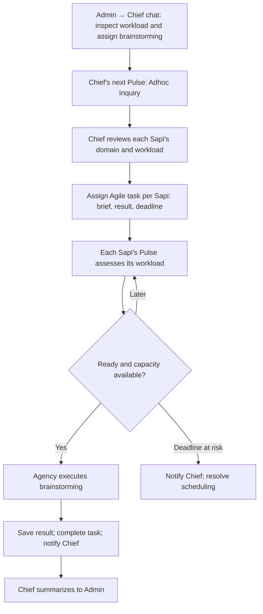

# 1. Domain brainstorming across Sapis

Admin asks Chief to inspect every Sapi's workload and assign domain-specific
brainstorming within a few hours. Admin's explicit deadline governs; otherwise
Chief chooses it. The incoming Inquiry is Adhoc; the resulting assignments are
Agile tasks. Pulse admission must consider deadlines and capacity, not assume
that periodic ticks alone guarantee timely completion.



```haskell
brainstorming = do
  request <- chat admin chief
    "Review each Sapi's workload and assign domain brainstorming"

  onNextPulse chief $
    classify request (Adhoc Inquiry)

  current <- inspectWorkload allSapis
  deadline <- case requestedDeadline request of
    Just time -> pure time
    Nothing   -> chiefChoosesDeadline current

  assigned <- forEach current $ \sapi ->
    assign chief sapi $
      AgileTask
        { objective = Brainstorm (domain sapi)
        , context   = currentWork sapi
        , due       = deadline
        }

  forEach assigned $ \task ->
    onPulse (assignee task) $
      when (ready task && capacityAvailable (assignee task)) $
        executeWithAgency task

  onDeadlineRisk assigned $ notify chief
  onCompleted assigned $ summarizeTo admin
```

`onPulse` denotes a persistent admission rule, not repeated execution of the
same task. Completed/running assignments are not started again on every tick.
Dates here are scenario requirements, not mandatory dates on every Task.
Chief's response when a deadline becomes infeasible remains a policy decision.
