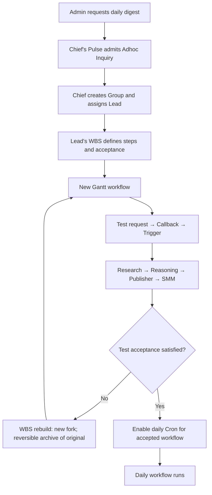

# 2. Build, test, and schedule a daily digest

Chief creates a Group involving Research, Reasoning, Publisher, and SMM Sapis,
and assigns its Lead. Lead uses WBS to create a Gantt workflow. A callback
initiates testing; only an accepted workflow is enabled for daily Cron.
The four participants are domain requirements, not an artificial ternary split.



```haskell
dailyDigest = do
  request <- chat admin chief "Establish a daily digest"
  onNextPulse chief $ classify request (Adhoc Inquiry)

  team <- chiefCreatesGroup
    [researchSapi, reasoningSapi, publisherSapi, smmSapi]
  lead <- chiefAssignsLead team

  definition <- leadExecutesWBS $
    WBS
      { objective   = "Produce and distribute a daily digest"
      , sourceWork  = [request]
      , constraints = [acceptanceCriteria, publicationPolicy]
      }

  -- Intended output: a Gantt combining LLM and script steps.
  -- Research -> Reasoning -> Publisher -> SMM
  testAndSchedule lead definition

testAndSchedule lead definition = do
  testRun <- initiate $
    Callback
      { hook      = TestRequested definition
      , condition = TestEnvironmentReady
      , reaction  = Trigger definition
      }

  case acceptance testRun of
    Failed findings -> do
      replacement <- leadExecutesWBS $ rebuild definition findings
      archiveReversibly definition
      requestTest replacement
      -- The next test uses this same acceptance procedure.

    Passed -> enable $
      Cron
        { schedule = Daily digestTime timezone
        , workflow = definition
        }
```

WBS produces definitions; it is not a third workflow initiator. Tests use
Callback → Trigger; daily operation uses Cron. Test configuration distinguishes
preview/draft output from authorized live publication. Timezone, missed runs,
overlapping runs, and the limit on test/rebuild attempts remain explicit policy
choices. Failed tests never enable the daily Cron.
