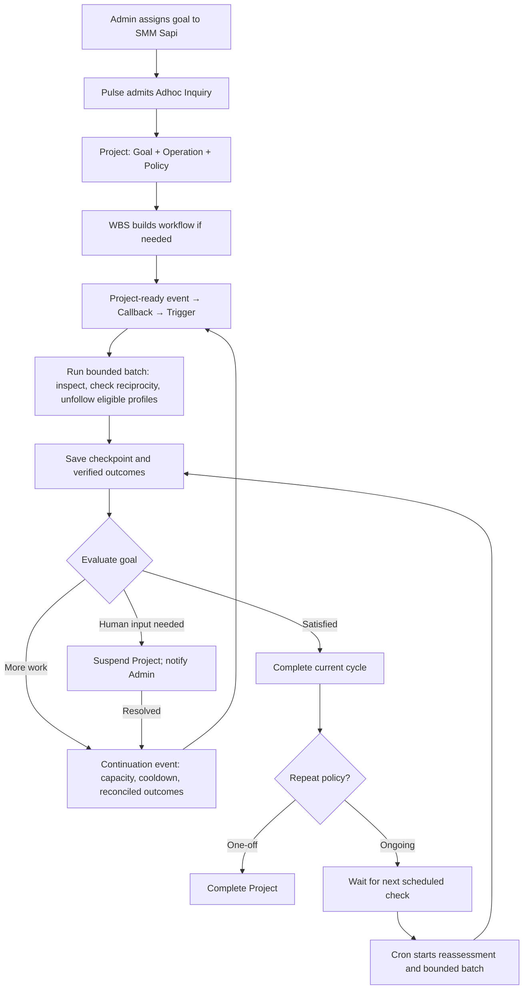

# 3. Instagram maintenance across bounded batches

A Project is a proposed addition: a persistent goal spanning workflow runs.
The SMM Sapi inspects followed profiles and unfollows eligible profiles that do
not follow back. Each run has a batch limit. Checkpoints preserve progress;
subsequent runs continue until the current goal is satisfied or human input is
needed. Ongoing maintenance repeats this process against the changed environment.



```haskell
-- Proposed conceptual composition; these are not type declarations.
-- Project     = Goal + Operation + Policy
-- Workflow    = reusable bounded operation
-- WorkflowRun = one execution attempt

instagramCleanup =
  Project
    { goal = NoEligibleNonFollowersRemain
    , operation =
        Gantt
          [ inspectFollowing
          , checkReciprocalFollow
          , unfollowEligibleProfiles
          ] `boundedBy` batchLimit
    , policy =
        Repeat
          { continueWhile = MoreWorkRemains
          , stopWhen      = GoalSatisfied
          , suspendWhen   = HumanInterventionRequired
          }
    }

startProject project =
  initiate $
    Callback
      { hook      = ProjectReady project
      , condition = AuthorizedAndReady project
      , reaction  = Trigger (operation project)
      }

afterBatch project run = do
  saveCheckpoint project run
  case evaluateGoal project run of
    MoreWorkRemains ->
      register $
        Callback
          { hook      = ContinuationReady project
          , condition = CapacityAvailable
                     && CooldownElapsed
                     && PreviousOutcomeReconciled
          , reaction  = Trigger (operation project)
          }

    HumanInterventionRequired reason -> do
      suspend project
      notify admin reason

    GoalSatisfied ->
      completeCurrentCycle project

maintainProject project schedule =
  enable $
    Cron
      { schedule = schedule
      , workflow = reassessAndProcessBatch project
      }
```

Project tracking is proposed under Tasks → Agile. WBS builds or revises its
work. Only Cron or Callback → Trigger starts a workflow; Pulse classifies and
admits pending work. A continuation starts a new batch, whereas a retry repeats
an unsuccessful attempt subject to a separate retry limit.

A maintenance cycle can span many bounded runs. Completing a one-off cycle
completes its Project; completing an ongoing cycle leaves the Project waiting
for its next scheduled reassessment. A suspended Project must not be restarted
by Cron until the blocking condition has been resolved.

Relationship checks must be fresh before mutation. Uncertain unfollow outcomes
need reconciliation before repetition. Access restrictions and platform limits
must be respected; they are not reasons for automatic evasion or blind retries.
Eligibility rules, batch/cooldown limits, checkpoints, deduplication and stopping
conditions still need concrete definitions. Indefinite maintenance means an
enabled repeat policy, not one infinitely running workflow.
